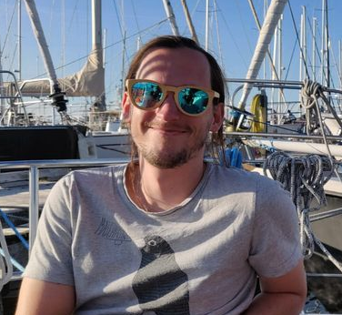

<h2>Interests</h2>

<ul>
	<li>Science: Chaos--Biophysics--Neuroscience--"Intelligent" Machines</li>
	<li>Sports: Squash, Bouldering, etc..</li>
	<li>Music, cooking etc</li>
</ul>

<h2>Education</h2>

<ul class="skill-list">
	<li>2014-now, Doctoral student, RWTH Aachen</li>
  <li>2012-2014, Masters of science in physics, HHU Duesseldorf</li>
	<li>2009-2012, Bachelor of science in physics, RWTH Aachen</li>
</ul>

<h2>Publications</h2>

<ul class="skill-list">
	<li><A href="https://www.frontiersin.org/articles/10.3389/fninf.2018.00046/full">Reproducing Polychronization: A Guide to Maximizing the Reproducibility of Spiking Network Models</A></li>
  <li><a href="https://www.sciencedirect.com/science/article/pii/S0306452219304750">Evaluation of Spike Sorting Algorithms: Application to Human Subthalamic Nucleus Recordings and Simulations</a></li>
	<li><a href="https://zenodo.org/record/32969">NEST 2.8.0</a></li>

</ul>
